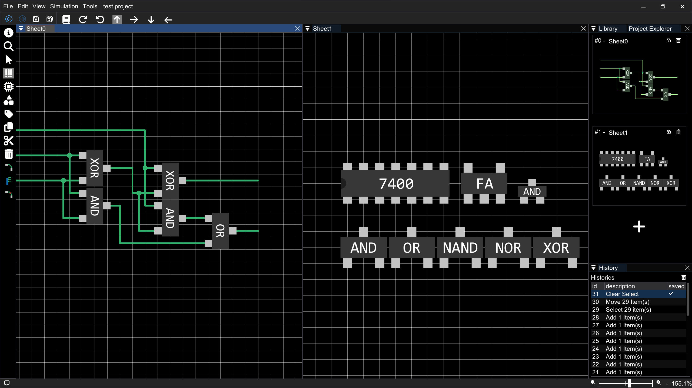

# Micro Logic
**Micro Logic** is a real time digital logic circuit simulator.




# Build
Cross platform is under consideration. Therefore source files for specific platform are separated for further platform implementations. But currently Windows is only avalilable. This project uses **Visual Studio** for build and **vcpkg** for managing packages. following packages are required.

### vckpkg pakage list
* ImGui
* ImGui-Docking
* freetype
* tinyxml2

to install above pakages type following commands.
```
vcpkg install imgui[docking-experimental]
vcpkg install tinyxml2
```

### Vulkan SDK
Since the project uses it's own 2d grphics library **vk2d**. So you have to install [Vulkan SDK](https://vulkan.lunarg.com/).

# To Do
* consider using boost::fast_pool_allocator
* upgrade bvh insertion code
* allow bvh to batch insertion
* compress clipboard data
* optimize blocking test
* modify Command_Add for Wire
* add cubic bezier to draw command
* add category to logic gate
* add filter to library window
* add classic logic gate symbols